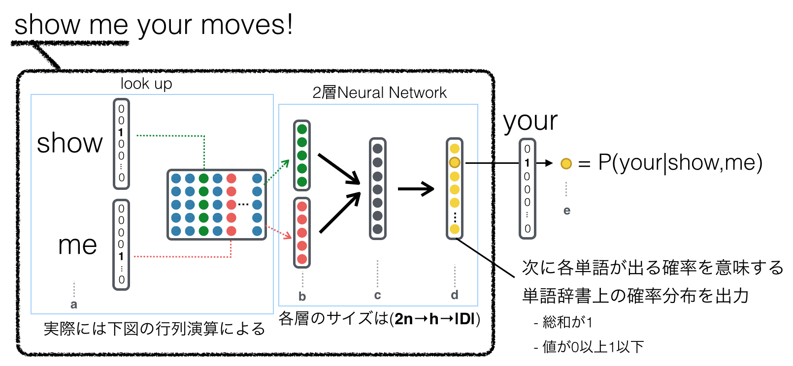

# Efficient Estimation of Word Representations in Vector Space
Tomas Mikolov, Kai Chen, Greg Corrado, Jeffrey Dean; ICLR 2013

上一周我们推荐了Mikolov的另一篇关于word2vec的论文，主要针对skip-gram模型性能的优化。本周推荐的这篇文章则是奠定了word2vec的基础。首先，Mikolov提出两种新的类神经网络语言模型（没有隐层），并且它们的复杂度远低于之前的NNLM和RNNLM模型。其次，作者也非常精巧的验证了这两种模型在句法和语义上的高准确度。小编还认为，这两种模型在自然语言处理之外，在如推荐系统，网络分析等，都有很强的潜力。

关于CBOW和skip-gram在词向量上的性质与表现，寅叔在上周的论文推荐里都做了详尽的解释，在此文就按下不表。本周我们就集中于讨论模型复杂度与扩展应用的话题。

谈到语言模型的复杂度，有必要从神经网络语言模型的开山鼻祖NNLM说起，其后的模型都是对其在参数上的简化。NNLM是一个四层神经网络模型，有输入层，投影层（projection layer， 将词转化为词向量/embedding vector)，隐层，和输出层。其训练窗口长度是N+1，也就是在预测最后一词时看前N个词（ngram-模型）。而隐层是一个N\*D的矩阵，其中D即为词向量的维度。它的隐层有H个节点，使用tanh作为激活函数。并且输出层是V维，与词汇表长度相同。这样一来，它的复杂度即为 Q=N\*D+N\*D\*H+H\*V。计算瓶颈就在于映射层到隐层计算的复杂度，也就是N\*D\*H。

下图虽然是日文，但我个人觉得是最直观解释NNLM中最直观的一副，特别展示了在投影层的矩阵中取出shoe和me相对应的两行并首尾相连形成新的举证作为隐层的输入项的过程。

Mikolov在NNLM的基础上，通过缩减参数，水了好几篇论文，比较著名的一种是利用RNNLM（Recurrent Neural Network Language Model）。这种方法相对于NNLM减少了映射层，模型的输入为新词与上一次计算的隐层，从而计算出新的隐藏层，如此往复。那么，它的计算瓶颈在于上一隐层与下一隐层的计算，也就是H\*H。

再博士毕业后，Mikolov大神来到了谷歌，继续对基于NNLM的模型进行运算效率上的改进。这一次，他对隐层开了刀。CBOW（Continuous Bag-of-Words）和Skip-gram模型都只有三层（如下图），输层入，投射层和输出层。以CBOW为例，某词的上下文中的N个词都投射到一个D维的投影层，再通过分类器最大化改词的概率。Skip-gram则与CBOW结构相反，是输入某个词，再去最大化它上下文的概率。这样他们的复杂度都分别被被简化到N\*D + D\*log_2(V)和C\*(D+D\*log_2(V))。

对比其他语言模型，skip-gram模型在语义上表现最为优异；而CBOW模型在句法上表现最好，而skip-gram紧随其后。

**一点思考**

这篇论文虽然没有提及两种模型在语言模型之外的应用，但小编个人认为它应该在序列数据的特征工程上有更大的空间。本质上来讲，skip-gram和CBOW较NNLM模型更为灵活，像是一个利用神经网络思想的矩阵分解。
在知乎上，orangeprince提到将用户下载app的数据作为序列，并运用word2vec计算对应的向量，再计算向量间的相似度。类似的，知乎作者张俊也用word2vec计算论文的相似度。链接见参考文章。

参考文献：

Efficient estimation of word representations in vector space arXiv preprint arXiv:1301.3781 (2013) by Tomas Mikolov, Kai Chen, Greg Corrado, Jeffrey Dean

Efficient Estimation of Word Representations in Vector Space(2016.05.25)，by 张俊, 
https://zhuanlan.zhihu.com/p/21241739

word2vec有什么应用？ by orangeprince,
https://www.zhihu.com/question/25269336

