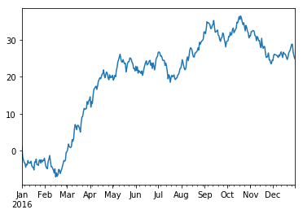

## We believe two languages can be killed with one stone!
***
***

We cover how to create time series and visualize them in this article. The graph looks different because the random seed in R and Python are different

####In R
```{r}
library(zoo)
time <- seq(from = as.Date("2016-01-01"), to = as.Date("2016-12-31"), by = 'day')
#make x a random walk time series
x <- cumsum(rnorm(366,0,1))
ts.x <- zoo(x, time)
plot(ts.x)
```

####In Python
```{python,engine.path="/Users/lawrence/anaconda/bin/python"}
from numpy.random import randn
import pandas as pd
ts = pd.Series(randn(366), index=pd.date_range('1/1/2016', periods=366))
#make ts a random walk time series
ts = ts.cumsum()

ts.plot()
```

Output image:
